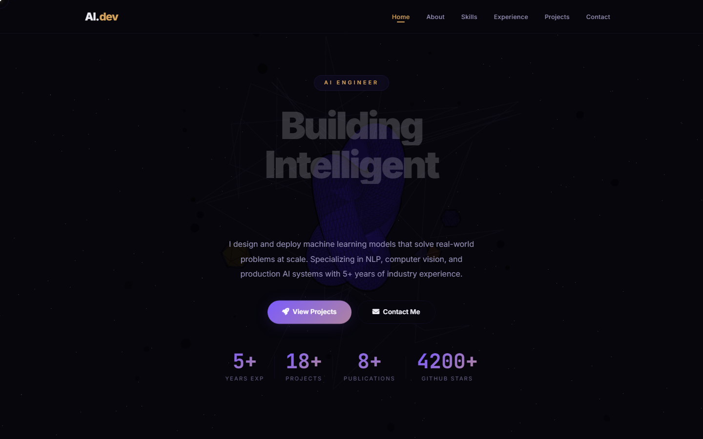
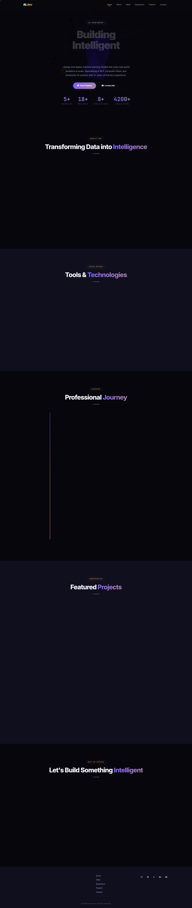
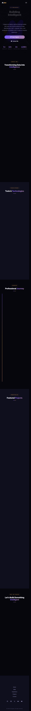

# Portofolio Website — AI Engineer

Portofolio website interaktif dengan pengalaman 3D imersif, smooth scroll, dan micro-animasi bertaraf Awwwards. Dibangun menggunakan Express.js, Three.js, GSAP, dan Lenis.

## Screenshot





## Fitur

- **3D Scene Interaktif** — Torus knot + geometric shapes berorbit + starfield + efek parallax mouse
- **Smooth Scroll** — Lenis dengan GSAP ScrollTrigger untuk scroll buttery dan animasi tersinkronisasi
- **Glassmorphism** — Card transparan dengan backdrop-filter blur dan border glow
- **Micro-interactions** — Custom cursor, magnetic buttons, 3D tilt card, scroll progress bar, active nav tracking
- **Split-text Hero** — Animasi karakter per baris dengan GSAP
- **Admin Dashboard** — CRUD untuk semua konten (about, skills, experience, projects, contact, footer)
- **Fully Responsive** — Mobile-first, breakpoints di 1024px, 768px, 480px, 360px
- **REST API** — Semua data dikelola via API endpoint dengan Basic Auth

## Tech Stack

| Frontend | Backend |
|----------|---------|
| Three.js r128 (3D) | Express.js |
| GSAP 3.12.5 + ScrollTrigger | Node.js |
| Lenis 1.1.16 (smooth scroll) | REST API |
| Vanilla JS (ES6) | Basic Auth |
| CSS3 (custom properties, glassmorphism, grid) | JSON file storage |

## Struktur File

```
portofolio-website/
├── admin/
│   ├── admin.js       # Admin dashboard logic (CRUD)
│   └── admin.css      # Admin dashboard styles
├── api-loader.js       # Fetch data dari API → render DOM
├── data.json           # Semua konten website (hero, about, skills, etc.)
├── index.html          # Halaman utama dengan all CDN scripts
├── script.js           # Lenis, GSAP, cursor, tilt, magnetic, nav, contact form
├── styles.css          # Full CSS design system (glassmorphism, responsive)
├── three-background.js # Three.js immersive 3D scene
├── server.js           # Express server + REST API + Basic Auth
├── package.json        # Dependencies (express)
└── README.md           # Dokumentasi ini
```

## Cara Install & Menjalankan

### Prasyarat

- [Node.js](https://nodejs.org/) v16 atau lebih baru
- npm (sudah termasuk dengan Node.js)

### Langkah-langkah

```bash
# 1. Clone repositori
git clone https://github.com/UmarFaruqManek/portofolio-website.git
cd portofolio-website

# 2. Install dependencies
npm install

# 3. Jalankan server
npm start
```

Server akan berjalan di `http://localhost:3000`.

### Admin Dashboard

Buka `http://localhost:3000/admin/` dan login dengan:

| Username | Password |
|----------|----------|
| admin    | admin123 |

Dari dashboard admin, Anda bisa:
- Menambah / mengedit / menghapus konten di setiap section
- Data tersimpan otomatis ke `data.json`
- Perubahan langsung tampil di halaman utama (refresh)

## API Endpoints

| Method | Endpoint | Deskripsi |
|--------|----------|-----------|
| GET | `/api/:section` | Ambil data section (hero, about, skills, experience, projects, contact, footer) |
| PUT | `/api/:section` | Update data section (auth required) |
| POST | `/api/:section/:action` | Tambah item (add) atau hapus (delete) — auth required |

Semua PUT/POST request memerlukan Basic Auth header (`admin:admin123`).

## Kustomisasi

### Mengubah Konten

Edit `data.json` langsung atau gunakan Admin Dashboard.

### Mengubah Warna

Edit CSS variables di `:root` dalam `styles.css`:

```css
--accent-1: #7c5cfc;    /* Primary accent (purple) */
--accent-2: #d4a25a;    /* Secondary accent (gold) */
--accent-3: #f09a7a;    /* Tertiary accent (coral) */
```

### Mengubah 3D Scene

Edit `three-background.js` — semua objek Three.js dapat dimodifikasi (warna, ukuran, orbit speed, dll).

### Mengubah Animasi

Edit `script.js` — GSAP ScrollTrigger animations, Lenis config, dan semua micro-interactions ada di sini.

## Dependencies (CDN)

Library berikut diload via CDN di `index.html` (tidak perlu npm install):

- [Three.js r128](https://cdnjs.cloudflare.com/ajax/libs/three.js/r128/three.min.js)
- [GSAP 3.12.5](https://cdnjs.cloudflare.com/ajax/libs/gsap/3.12.5/gsap.min.js)
- [GSAP ScrollTrigger](https://cdnjs.cloudflare.com/ajax/libs/gsap/3.12.5/ScrollTrigger.min.js)
- [Lenis 1.1.16](https://unpkg.com/lenis@1.1.16/dist/lenis.min.js)
- [Font Awesome 6.5.0](https://cdnjs.cloudflare.com/ajax/libs/font-awesome/6.5.0/css/all.min.css)
- [Google Fonts: Inter + JetBrains Mono](https://fonts.googleapis.com/)

Satu-satunya dependency npm adalah **Express.js** untuk server.

## Lisensi

MIT
